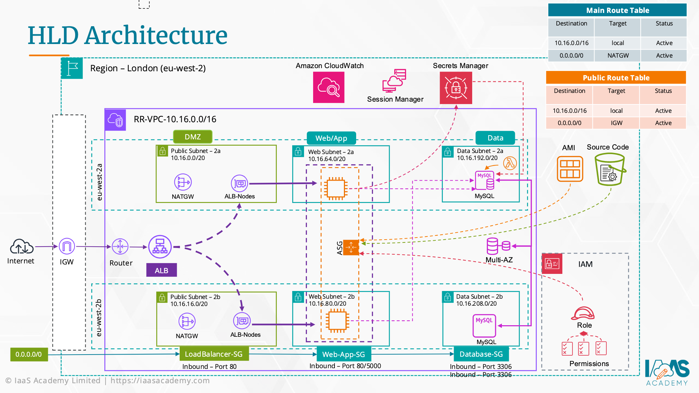
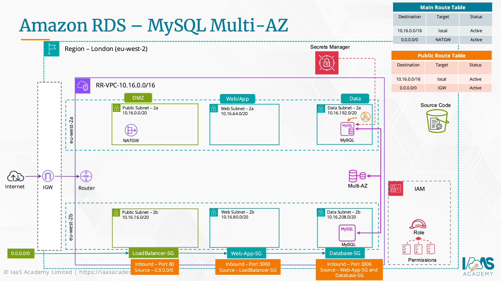
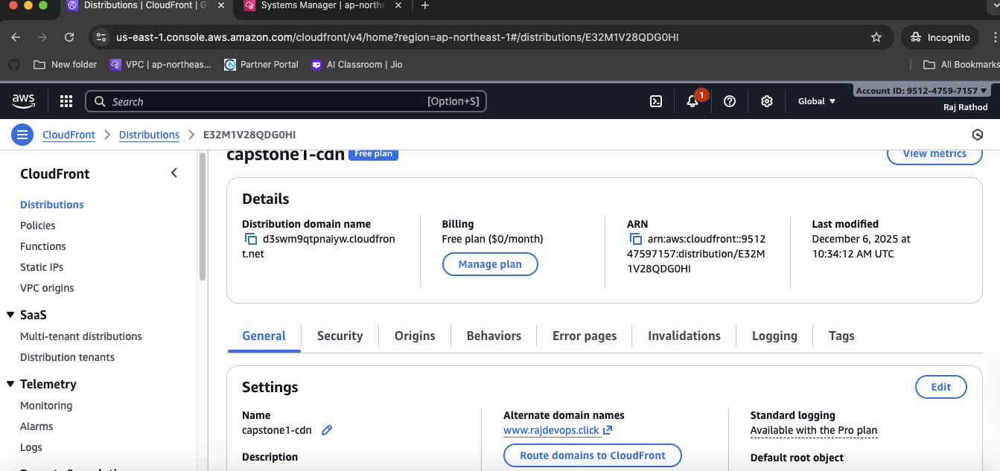
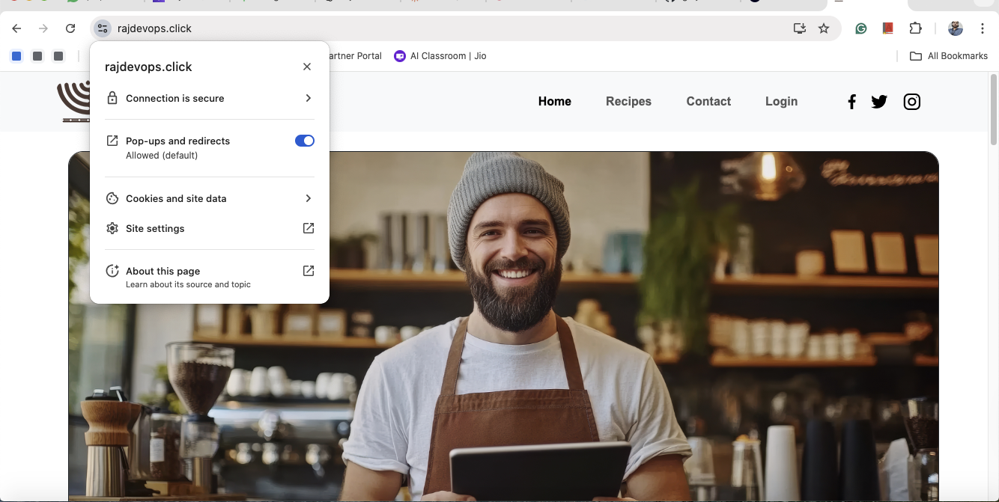

# ☕ Ritual Roast – Enterprise 3-Tier Web Architecture on AWS

A highly available, fault-tolerant, and secure recipe submission platform deployed on **Amazon Web Services** using a **3-tier multi-AZ architecture**.

This implementation is inspired by the **AWS Cloud Architect Capstone Project**, extended beyond the original lab to include **CloudFront CDN** and a **custom domain**.

---

## 🌐 Live Demo

👉 [https://www.rajdevops.click](https://www.rajdevops.click)

---

## 📖 Overview

This project implements a production-style architecture using:

- **Private Compute Network** (App Tier protected from internet)
- **Managed Database** (RDS MySQL, Multi-AZ for disaster recovery)
- **Application Load Balancer** for intelligent HTTP routing
- **CloudFront CDN** for global caching and SSL termination
- **Route 53** for custom domain resolution
- **Secrets Manager** for secure credential storage (Zero Hardcoded Secrets)

It follows key AWS **Well-Architected Pillars**:
- Operational Excellence
- Reliability
- Security
- Performance
- Cost Optimization

---

## 🏗 High-Level Architecture

**User Request Flow:**

\`\`\`mermaid
Browser
  ↓ HTTPS (Global)
CloudFront CDN
  ↓ HTTP (Regional)
Application Load Balancer
  ↓ HTTP : 5000
EC2 Auto Scaling Group (Flask + React)
  ↓ Port 3306
RDS MySQL (Multi-AZ)
  ↓
Secrets Manager (DB Credentials)
\`\`\`

**Architecture Diagram:**

---

## 🔧 Infrastructure Details

### 1️⃣ Networking — VPC Design
- **Region:** ap-northeast-1 (Tokyo)
- **CIDR:** 10.16.0.0/16
- **Subnets:**
  - 2 × Public (ALB, NAT Gateway)
  - 2 × Private App (EC2 Instances)
  - 2 × Private Data (RDS Database)
- **Routing:**
  - Public → Internet Gateway
  - App → NAT Gateway (Secure outbound access)
  - Data → No egress internet

**Network Flow Diagram:**

---

### 2️⃣ Compute Layer — EC2 & Auto Scaling
- **Instances:** \`t3.micro\` (or \`t3.medium\` for faster boot)
- **Launch Template:** Bootstrapped via \`user-data.sh\`
- **Auto Scaling:**
  - Min: 2
  - Max: 3
- **Health Checks:** ELB + EC2 checks enabled
- **AMI:** Amazon Linux 2023
- **App:** Flask backend serving React static build

**Bootstrap Script:** [View Script](scripts/user-data.sh)

---

### 3️⃣ Security & Identity

**IAM Role for EC2:**
- \`AmazonSSMManagedInstanceCore\` (Session Manager access)
- \`AmazonS3FullAccess\` (Artifact download)
- Inline policy → Secrets Manager (Least Privilege)

**Security Group Chaining:**
- \`ALB-SG\`: Allows inbound HTTP (80) / HTTPS (443) from World.
- \`App-SG\`: Allows Port \`5000\` **only** from \`ALB-SG\`.
- \`DB-SG\`: Allows Port \`3306\` **only** from \`App-SG\`.

*Result: No public access to EC2 or RDS is possible.*

---

### 4️⃣ Database Layer — RDS MySQL

- **Engine:** MySQL 8.0
- **Deployment:** Multi-AZ (Synchronous Standby)
- **Security:** Storage encryption enabled
- **Credentials:** Stored in Secrets Manager path \`/virtualroast/db/admin\`
- **Connection:** App fetches credentials using Boto3 at runtime.

---

## 🌀 Global Caching — CloudFront & Custom Domain

- **Origin:** Application Load Balancer
- **Viewer Protocol:** Redirect HTTP → HTTPS
- **Caching:** configured to bypass dynamic content but secure the connection.
- **SSL:** ACM certificate (us-east-1)
- **Custom Domain:** \`www.rajdevops.click\` via Route 53 Alias → CloudFront

**Proof of Global SSL:**

---

## 🛠 Deployment Highlights

The app is fully automated from EC2 User Data:

1. System updates & dependency installation (Python, Pip, Git).
2. AWS CLI installation.
3. Sync application code from secure S3 bucket.
4. Install Python requirements.
5. Retrieve DB credentials from Secrets Manager.
6. Start Flask app on port 5000.

---

## 🧪 Real-World Troubleshooting

During deployment, the following critical issues were diagnosed and resolved:

1. **503 Service Unavailable**
   - **Root Cause:** ALB Default Action was set to "Return Fixed Response" instead of forwarding to Target Group.
   - **Fix:** Updated Listener Rule to "Forward to Target Group".

2. **Package Install Failing (Boot Hang)**
   - **Root Cause:** Private subnet Route Table was missing the route to the NAT Gateway, causing \`pip install\` to time out.
   - **Fix:** Corrected Private Route Table association to point \`0.0.0.0/0\` → NAT Gateway.

3. **Database Connection Timeout (Error 110)**
   - **Root Cause:** Database Security Group did not allow inbound traffic from the App Security Group.
   - **Fix:** Implemented Security Group Chaining (Source: \`sg-app\`).

*This hands-on debugging replicates real production incidents.*

---

## 📁 Repository Structure

\`\`\`text
aws-ritual-roast-capstone/
├── README.md
├── diagrams/
│   ├── HLD-Architecture.png
│   └── LLD-Network-Flow.png
├── screenshots/
│   ├── autoscaling-proof.png
│   ├── cloudfront-proof.png
│   ├── target-health.png
│   └── website-live.png
├── scripts/
│   └── user-data.sh
└── src/
    ├── requirements.txt
    └── ritual-roast.py
\`\`\`

---

## 🚀 Future Improvements

- Use **Gunicorn** instead of Flask dev server for better concurrency.
- Add **AWS WAF** in front of CloudFront to block SQL injection.
- Containerize the app using **Docker + ECS**.
- Infrastructure as Code (Terraform / CDK).
- CI/CD pipeline using **GitHub Actions**.

---

## 🏆 Credits

This project is inspired by the **AWS Cloud Architect** program by **Rajesh Daswani**, extended into a real-world deployment with Custom Domains and CDN.